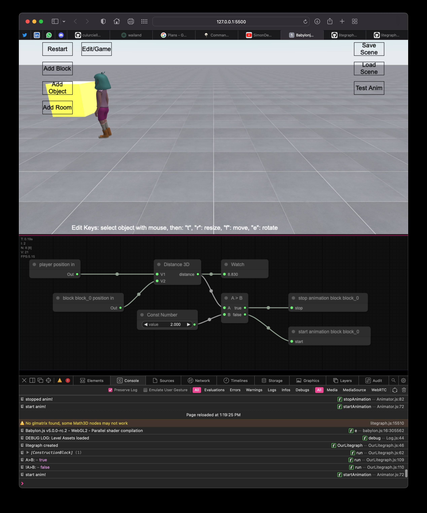

# Game editor with BabylonJS

Build a game in your garage




### Installation
```
cd static/
npm install --save
```

### Run
`python3 app.py`


### Notes:

[LiteGraph.JS](https://github.com/jagenjo/litegraph.js) is used to implement visual programming:

```npm install litegraph.js```


GRAPHICAL NODES:

Graphical Nodes are implementing logic game function with nodes and ports that can be connected in graphical design, with no programming required. These implement Game Design functions for No-Code game design.

Here we implemented:

- graphicalPorts are connections between nodes:
	- moveWith: position this node = position nodeFrom + offset

- connection = {nodeFrom, port}


### Repo rules:

	1- keep it simple / Occam's razor
	2- do not commit large files
	3- keep master working, or in "best state"
	4- make branches for any major addition, merge to master when done and tested
	5- review code and merge with other team members